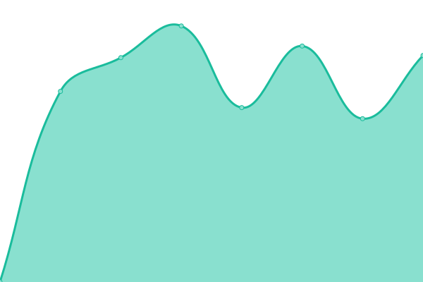

# [📈 Live Status](https://up.unia.xyz): <!--live status--> **🟩 All systems operational**

This repository contains the open-source uptime monitor and status page for [Dat Le Thanh](https://up.unia.xyz), powered by [Upptime](https://github.com/upptime/upptime).

With [Upptime](https://upptime.js.org), you can get your own unlimited and free uptime monitor and status page, powered entirely by a GitHub repository. We use [Issues](https://github.com/dat-leth/up.unia.xyz/issues) as incident reports, [Actions](https://github.com/dat-leth/up.unia.xyz/actions) as uptime monitors, and [Pages](https://up.unia.xyz) for the status page.

<!--start: status pages-->
<!-- This summary is generated by Upptime (https://github.com/upptime/upptime) -->
<!-- Do not edit this manually, your changes will be overwritten -->
<!-- prettier-ignore -->
| URL | Status | History | Response Time | Uptime |
| --- | ------ | ------- | ------------- | ------ |
|  [Homepage](https://www.uni-augsburg.de) | 🟩 Up | [homepage.yml](https://github.com/dat-leth/up.unia.xyz/commits/HEAD/history/homepage.yml) | 

 2844ms
     
 | 

<a href="https://up.unia.xyz/history/homepage">100.00%</a>
    

|  [Digicampus](https://digicampus.uni-augsburg.de) | 🟩 Up | [digicampus.yml](https://github.com/dat-leth/up.unia.xyz/commits/HEAD/history/digicampus.yml) | 

 741ms
     
 | 

<a href="https://up.unia.xyz/history/digicampus">100.00%</a>
    

|  [VIBS](https://vibs.uni-augsburg.de/qisserver/pages/cs/sys/portal/hisinoneStartPage.faces) | 🟩 Up | [vibs.yml](https://github.com/dat-leth/up.unia.xyz/commits/HEAD/history/vibs.yml) | 

 1438ms
     
 | 

<a href="https://up.unia.xyz/history/vibs">100.00%</a>
    

|  [STUDIS](https://studiswebstud.zv.uni-augsburg.de/FN2SSS/) | 🟩 Up | [studis.yml](https://github.com/dat-leth/up.unia.xyz/commits/HEAD/history/studis.yml) | 

 2443ms
     
 | 

<a href="https://up.unia.xyz/history/studis">100.00%</a>
    

|  [Webmail](https://webmail.uni-augsburg.de/) | 🟩 Up | [webmail.yml](https://github.com/dat-leth/up.unia.xyz/commits/HEAD/history/webmail.yml) | 

 692ms
     
 | 

<a href="https://up.unia.xyz/history/webmail">100.00%</a>
    

|  [Kalender](https://mycal.rz.uni-augsburg.de/SOGo/) | 🟩 Up | [kalender.yml](https://github.com/dat-leth/up.unia.xyz/commits/HEAD/history/kalender.yml) | 

 690ms
     
 | 

<a href="https://up.unia.xyz/history/kalender">100.00%</a>
    

|  [Megastore](https://megastore.rz.uni-augsburg.de/fcgi/do) | 🟩 Up | [megastore.yml](https://github.com/dat-leth/up.unia.xyz/commits/HEAD/history/megastore.yml) | 

 710ms
     
 | 

<a href="https://up.unia.xyz/history/megastore">100.00%</a>
    

|  [Mediastore](https://mediastore.rz.uni-augsburg.de/fcgi/do) | 🟩 Up | [mediastore.yml](https://github.com/dat-leth/up.unia.xyz/commits/HEAD/history/mediastore.yml) | 

 797ms
     
 | 

<a href="https://up.unia.xyz/history/mediastore">100.00%</a>
    

|  [WebAuth Login (Digicampus, STUDIS, ...)](https://websso.uni-augsburg.de/login) | 🟩 Up | [web-auth-login-digicampus-studis.yml](https://github.com/dat-leth/up.unia.xyz/commits/HEAD/history/web-auth-login-digicampus-studis.yml) | 

 762ms
     
 | 

<a href="https://up.unia.xyz/history/web-auth-login-digicampus-studis">100.00%</a>
    

|  [SAML Login (Zoom, ...)](https://idp-local.rz.uni-augsburg.de/simplesaml/module.php/core/loginuserpass.php) | 🟩 Up | [saml-login-zoom.yml](https://github.com/dat-leth/up.unia.xyz/commits/HEAD/history/saml-login-zoom.yml) | 

 699ms
     
 | 

<a href="https://up.unia.xyz/history/saml-login-zoom">100.00%</a>
    

<!--end: status pages-->

[**Visit our status website →**](https://up.unia.xyz)

## 📄 License

- Powered by: [Upptime](https://github.com/upptime/upptime)
- Code: [MIT](./LICENSE) © [Dat Le Thanh](https://up.unia.xyz)
- Data in the `./history` directory: [Open Database License](https://opendatacommons.org/licenses/odbl/1-0/)
